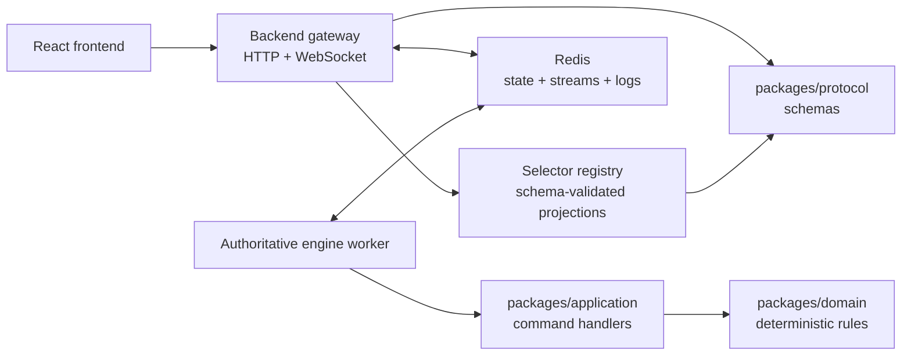

# Redis Authoritative Runtime Design

## Status

Approved for implementation planning on 2026-04-30.

## Context

Project. BH already follows the intended domain-centric monorepo shape:

- `packages/domain` owns deterministic match state and rule transitions.
- `packages/application` owns command handling and query use cases.
- `packages/protocol` owns network payload validation.
- `apps/server` owns HTTP, WebSocket, room lifecycle, player session lookup, and per-player projection.
- `apps/web` renders projected state and sends commands through the backend.

The current multiplayer shell is authoritative, but it is process-local. Rooms, player sessions, match snapshots, command logs, and WebSocket fanout state live in in-memory `Map` objects inside `apps/server`. That makes the current server useful for local playtests, but it cannot safely support process restarts, multiple backend instances, multiple engine workers, realistic room counts, or meaningful online-game load benchmarks.

## Goals

1. Store all game data, session data, metadata, temporary logs, match snapshots, and command/event history in Redis.
2. Preserve the current domain/application/protocol boundaries and keep game rules renderer-agnostic.
3. Split the runtime shape into frontend, backend gateway, and authoritative engine worker.
4. Allow backend and engine processes to exchange commands, events, and snapshots through Redis.
5. Expose frontend data only through explicit, versioned selectors that return exact schema-validated payloads.
6. Benchmark realistic online-game behavior with many rooms, players, WebSocket clients, commands, reconnects, and selector projections.
7. Strengthen session security so predictable tokens and token-only impersonation are not accepted as the long-term design.

## Non-goals

- Do not move game rules into Redis scripts, HTTP handlers, WebSocket callbacks, or React components.
- Do not introduce a separate SQL database in this slice.
- Do not make Redis the rules engine. Redis is infrastructure for persistence, streams, coordination, and temporary telemetry.
- Do not build production matchmaking, ranking, accounts, payments, or anti-cheat in this slice.
- Do not require Unity-specific client code yet. The contract must make Unity easier later, but the implementation target remains the browser-first prototype.

## Recommended Approach

Use Redis-backed repositories plus Redis Streams between the backend gateway and the engine worker.

This is preferred over only replacing `Map` objects with Redis because the project needs a real online-game shape: multiple rooms, multiple clients, process boundaries, reconnects, durable command logs, and measurable engine lag. It is also preferred over a full event-sourcing rewrite because the current domain state is already deterministic and tested. The first production-grade runtime should evolve the existing architecture instead of replacing it.

## Runtime Architecture

### Backend Gateway

The backend gateway owns:

- HTTP endpoints.
- WebSocket connections.
- player session verification.
- command envelope validation.
- rate limiting.
- writing accepted commands to Redis Streams.
- reading canonical snapshots/events from Redis.
- running selector projections for each viewer.
- broadcasting selector outputs to connected clients.

The backend gateway does not own:

- move legality.
- damage resolution.
- tile transformation.
- round progression.
- treasure ownership.
- scoring.
- command application.

### Engine Worker

The engine worker owns:

- consuming command stream entries.
- loading the latest canonical match snapshot.
- running `handleMatchCommand`.
- persisting the next canonical snapshot.
- appending authoritative event log entries.
- publishing match update notifications for backend fanout.
- recording deterministic command result metadata.

The engine worker must be horizontally safe. A single match stream entry must be claimed and applied by only one active worker. The first implementation can use one worker process and Redis consumer groups; the design must not depend on only one process forever.

### Redis

Redis stores:

- room metadata.
- player records.
- player session hashes.
- match snapshots.
- command stream entries.
- authoritative event stream entries.
- selector cache entries when useful.
- idempotency records.
- rate-limit counters.
- temporary operational logs and benchmark samples.

Redis does not store raw session tokens.

## Redis Key Model

Use one explicit prefix for the application:

- `bh:room:{roomId}`: room metadata hash or JSON.
- `bh:room:{roomId}:players`: room player list.
- `bh:room:{roomId}:sockets`: optional ephemeral connection metadata with short TTL.
- `bh:invite:{inviteCode}`: invite code to room id lookup.
- `bh:session:{sessionTokenHash}`: session binding to room id, player id, issued-at, expires-at, and credential metadata.
- `bh:player:{roomId}:{playerId}`: player display metadata and seat assignment.
- `bh:match:{sessionId}:snapshot`: canonical serialized `MatchState` plus log length and revision.
- `bh:match:{sessionId}:commands`: Redis Stream for backend-to-engine command envelopes.
- `bh:match:{sessionId}:events`: Redis Stream for engine-to-backend authoritative results.
- `bh:match:{sessionId}:idempotency:{commandId}`: short-lived command idempotency result.
- `bh:selector:{sessionId}:{viewerPlayerId}:{selectorId}:{revision}`: optional selector cache.
- `bh:ratelimit:{scope}:{id}:{window}`: rate-limit counters.
- `bh:logs:{yyyyMMdd}:{shard}`: temporary structured logs with TTL.
- `bh:bench:{runId}:samples`: benchmark samples with TTL.

The implementation may serialize values as JSON at first. Every persisted shape must be validated on read before entering application logic.

## Command Flow

1. Frontend sends a command request with `sessionToken`, command payload, and `commandId`.
2. Backend verifies the session token hash in Redis.
3. Backend rejects if the session is expired, revoked, bound to a different room, or blocked by rate limits.
4. Backend injects the authoritative `playerId`; the frontend-provided `playerId` is ignored.
5. Backend validates the command payload through `packages/protocol`.
6. Backend appends a command envelope to `bh:match:{sessionId}:commands`.
7. Engine consumes the stream entry.
8. Engine loads `bh:match:{sessionId}:snapshot`.
9. Engine calls `handleMatchCommand`.
10. Engine writes the new snapshot and appends an authoritative result to `bh:match:{sessionId}:events`.
11. Backend receives update notification or polls the event stream.
12. Backend runs selector projections for each connected viewer and sends exact selector payloads over WebSocket.

## Selector Contract

The frontend must not receive raw `MatchState`.

Add a selector registry in the server layer with protocol-owned output schemas. Each selector has:

- `selectorId`.
- `version`.
- `visibility`: `public`, `viewer`, or `admin`.
- input: canonical snapshot plus viewer identity when needed.
- output schema in `packages/protocol`.
- test coverage proving hidden fields are omitted.

Initial selectors:

- `room.lobbySummary.v1`
  - public room listing metadata only.
- `room.viewerState.v1`
  - room state plus viewer identity and room permissions.
- `match.publicBoard.v1`
  - board, visible players, visible treasure occupancy, round public metadata.
- `match.viewerHand.v1`
  - viewer priority cards, special inventory, carried treasure public id, opened treasure ids.
- `match.viewerTreasurePlacement.v1`
  - viewer placement hand during treasure placement only.
- `match.turnHints.v1`
  - server-derived legal affordances for the viewer.
- `match.auction.v1`
  - current offer, resolved offers, viewer bid status, submitted player ids.
- `match.snapshotBundle.v1`
  - explicit bundle used by the current React app, composed only from approved selectors.

The current `projectSnapshotForPlayer` function should be refactored into this registry rather than deleted. It already enforces many of the correct public/private boundaries.

## Security Design

### Session Tokens

Session tokens must be generated with high-entropy cryptographic randomness:

- use `crypto.randomBytes(32)` or `crypto.webcrypto.getRandomValues`.
- encode as base64url.
- never use short ids or invite codes as credentials.
- never store token plaintext in Redis.
- store `HMAC-SHA256(serverSecret, token)` or an equivalent keyed hash.

### Token Binding

A session token alone should not be enough for the long-term impersonation model. Add a second credential property:

- issue a `sessionToken` and a `clientInstanceId`.
- bind the Redis session to a rotating `connectionNonce` for WebSocket authentication.
- require command requests to include `commandId` and `clientInstanceId`.
- detect token reuse from a different client instance and mark the session suspicious.

For the browser prototype, this is not the same as strong device identity. It is still useful because it catches simple copied-token replay, supports revocation, and gives the server a place to add account/device binding later.

### Authorization

- Only the backend resolves token hash to `playerId`.
- Client-submitted `playerId` is not trusted.
- Host-only actions must check the resolved session player id.
- Match commands must check that the resolved player belongs to the room and the room owns the match session.
- Selector access must check visibility and viewer identity.

### Transport and Redis Hardening

- Replace permissive CORS `*` with an environment-driven allowlist before public deployment.
- Use HTTPS/WSS outside local development.
- Use Redis ACL users with the smallest command/key permissions available for backend and engine roles.
- Use TLS for managed Redis when available.
- Keep Redis connection strings and HMAC secrets out of source control.
- Redact session tokens from logs.
- Apply rate limits to room creation, joins, invite lookups, action queries, commands, and WebSocket upgrades.

## Benchmark Design

Create a Node benchmark harness that can run against a local or remote backend.

Scenarios:

- lobby browse with many public rooms.
- room creation burst.
- invite join burst.
- start many rooms.
- steady-state commands across many started rooms.
- WebSocket fanout with 2, 3, and 4 players per room.
- reconnect storm after clients disconnect.
- invalid token and invalid command noise.
- selector-heavy snapshot refresh.

Target dimensions:

- 100 rooms x 2 players.
- 500 rooms x 4 players.
- 1000 rooms x 4 players.
- configurable command rate per active room.

Metrics:

- room create p50/p95/p99 latency.
- join p50/p95/p99 latency.
- command accepted to engine-applied p50/p95/p99 latency.
- event fanout p50/p95/p99 latency.
- Redis stream lag per match and globally.
- selector projection duration and payload size.
- WebSocket messages per second.
- reconnect recovery time.
- memory per room.
- rejected invalid auth attempts per second.

Benchmark output should be written to JSONL so later runs can be compared in CI or local reports.

## Testing Strategy

Add tests at the boundary where behavior lives:

- protocol tests for selector schemas and command envelopes.
- server unit tests for selector registry visibility.
- server integration tests using an in-memory Redis-compatible fake for repository behavior.
- Redis adapter tests that can run when `REDIS_URL` is present.
- engine worker tests for idempotency, stream consumption, snapshot writes, and rejection events.
- security tests for token hashing, invalid token rejection, host-only permissions, replayed command ids, and redacted logs.
- benchmark smoke tests with small room/player counts.

Domain tests should not require Redis.

## Migration Plan

1. Add selector schemas and registry while keeping the current in-memory runtime.
2. Add storage and stream ports plus in-memory implementations.
3. Add Redis implementations behind the same ports.
4. Extract engine worker logic but run it in-process for tests.
5. Switch backend command submission from direct `engine.dispatchRawCommand` to queued command envelopes.
6. Add standalone engine process entrypoint.
7. Add benchmark harness.
8. Add security hardening and docs.
9. Make Redis runtime opt-in through environment configuration.
10. Promote Redis runtime to default after integration tests and benchmark smoke tests pass.

## Documentation Updates

Implementation must update:

- `docs/architecture/overview.md`
- `docs/networking/protocol.md`
- `docs/testing/test-strategy.md`
- `docs/migration/unity-parity.md`

The docs must explain that Redis is infrastructure and that deterministic rules remain in domain/application packages.

## Open Decisions Resolved For This Plan

- Redis Streams are the command/event transport between backend and engine.
- Selector output schemas live in `packages/protocol`.
- Selector registry lives in `apps/server` because it is a presentation/security boundary over canonical state.
- Session token plaintext is never persisted.
- Benchmarks are implemented as a repository script, not as manual instructions.
